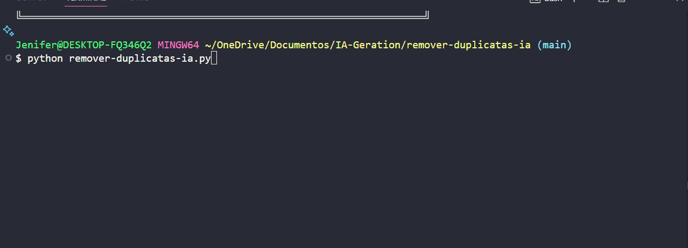

# 🐍 Desafio de Programação: Remover Duplicatas de uma Lista

## 👩‍💻 Participantes

- **Ewerton Bertoldo**
- **Jenifer Placido**

---

## 📚 Sobre o Projeto

Este projeto apresenta uma solução didática para o desafio de remover elementos duplicados de uma lista em Python, mantendo a ordem original.  
Além da função, o programa traz uma animação divertida de uma cobrinha Python no terminal e exibe os resultados dos testes em caixas desenhadas, tornando o aprendizado mais visual e interativo!

---

## 🎯 Objetivo Principal

- Criar uma função chamada `remover_duplicatas(array)` que recebe uma lista e retorna uma nova lista apenas com elementos únicos, preservando a ordem de aparição.

---

## 🧠 Estratégia

- Utilizar um laço (`for`) para percorrer cada elemento da lista original.
- Usar uma lista auxiliar para armazenar apenas os elementos que ainda não apareceram.
- Garantir que a ordem dos elementos seja mantida.
- Exibir os resultados de forma visual e amigável, com animação e caixas no terminal.

---

## 📝 Refinamento do Prompt

O prompt foi refinado em etapas para tornar o desafio mais didático e divertido:

- Inicialmente, pediu-se apenas a função para remover duplicatas.
- Depois, foi solicitado que a função tivesse comentários explicativos para iniciantes.
- Em seguida, foi sugerido adicionar testes automáticos e apresentação visual dos resultados.
- Por fim, foi incluída uma animação de uma cobrinha Python para tornar o projeto mais interativo e engajador.

---

## 🤖 Estratégia com GitHub Copilot

O GitHub Copilot foi utilizado em diferentes etapas:
- Sugeriu implementações iniciais para a função.
- Indicou abordagens alternativas, como o uso de `dict.fromkeys()` ou list comprehensions.
- Auxiliou na refatoração, melhorando clareza e eficiência do código.
- Ajudou a automatizar a execução dos testes.
- Sugeriu a ideia de adicionar animação e melhorar a apresentação dos resultados.

---

## 📝 Código Principal

```python
import time
import os

def remover_duplicatas(array):
    # Função para remover duplicatas mantendo a ordem
    unicos = []
    for elemento in array:
        if elemento not in unicos:
            unicos.append(elemento)
    return unicos

# Frames para animação da cobrinha Python
frames = [
    r"""
         ____
       / . .\
      \  ---<
       \  /
  ______/ /
 /______/ 
""",
    r"""
          ____
        / . .\
       \  ---<
        \  /
   ______/ /
  /______/ 
""",
    r"""
           ____
         / . .\
        \  ---<
         \  /
    ______/ /
   /______/ 
""",
    r"""
            ____
          / . .\
         \  ---<
          \  /
     ______/ /
    /______/ 
"""
]

# Animação da cobrinha Python
for frame in frames + frames[::-1]:
    os.system('cls' if os.name == 'nt' else 'clear')
    print(frame)
    print("Bem-vindo ao removedor de duplicatas em Python!\n")
    time.sleep(0.5)

# Testes bonitos com pausa entre eles
print("╔════════════════════════════════════════════════════════════════════╗")
print("║ Teste 1: [1, 2, 2, 3, 'b', 'a', 'c', 'd', 'd']                   ║")
print("╠════════════════════════════════════════════════════════════════════╣")
resultado1 = remover_duplicatas([1, 2, 2, 3, 'b', 'a', 'c', 'd', 'd'])
print(f"║ Resultado: {resultado1}{' ' * (56 - len(str(resultado1)))}║")
print("╚════════════════════════════════════════════════════════════════════╝\n")
time.sleep(2)

print("╔════════════════════════════════════════════════════════════════════╗")
print("║ Teste 2: [1, 1, 1, 1]                                            ║")
print("╠════════════════════════════════════════════════════════════════════╣")
resultado2 = remover_duplicatas([1, 1, 1, 1])
print(f"║ Resultado: {resultado2}{' ' * (56 - len(str(resultado2)))}║")
print("╚════════════════════════════════════════════════════════════════════╝\n")
time.sleep(2)

print("╔════════════════════════════════════════════════════════════════════╗")
print("║ Teste 3: []                                                      ║")
print("╠════════════════════════════════════════════════════════════════════╣")
resultado3 = remover_duplicatas([])
print(f"║ Resultado: {resultado3}{' ' * (56 - len(str(resultado3)))}║")
print("╚════════════════════════════════════════════════════════════════════╝")
```

---

## 💡 Lógica usada

- A função percorre cada elemento da lista original.
- Se o elemento ainda não está na lista de únicos, ele é adicionado.
- Assim, apenas o primeiro de cada valor aparece no resultado, mantendo a ordem original.

---

## 🤖 Como a IA ajudou

- Sugeriu a estrutura básica da função e a lógica de verificação de duplicatas.
- Ajudou a criar a animação da cobrinha Python para tornar o projeto mais divertido.
- Sugeriu melhorias nos testes e na apresentação dos resultados.
- Auxiliou na escrita de comentários didáticos para facilitar o entendimento de quem está começando.

---

## 🏁 Resultado no Terminal

🎥 *Veja o vídeo abaixo para conferir a animação e os testes rodando no terminal!*

---

## 📝 Dicas para quem está começando

- Leia os comentários no código para entender cada etapa.
- Experimente modificar os testes ou a animação para praticar!
- Use o terminal do VS Code para rodar o programa e ver a animação.

---